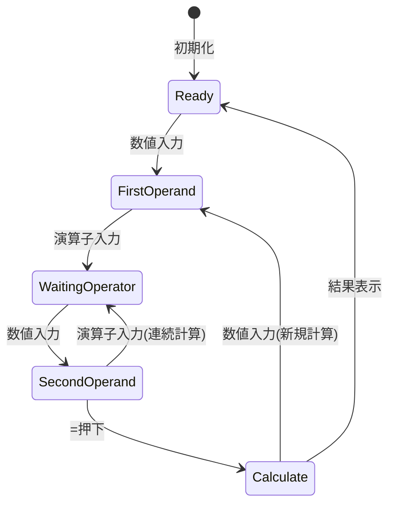

# 計算機能仕様書

## 1. 概要
電卓アプリケーションの四則演算計算機能の詳細仕様を定義する。

## 2. 四則演算機能

### 2.1 加算（+）
#### 2.1.1 基本仕様
- **演算子**: +
- **計算式**: a + b
- **精度**: JavaScript Number型の精度に準拠
- **範囲**: ±1.7976931348623157e+308

#### 2.1.2 特殊ケース
| ケース | 入力例 | 結果 | 備考 |
|--------|--------|------|------|
| 正数 + 正数 | 5 + 3 | 8 | 通常計算 |
| 正数 + 負数 | 5 + (-3) | 2 | 実質減算 |
| 負数 + 負数 | (-5) + (-3) | -8 | 負数の合計 |
| 小数点計算 | 0.1 + 0.2 | 0.30000000000000004 | 浮動少数点誤差 |

### 2.2 減算（-）
#### 2.2.1 基本仕様
- **演算子**: -
- **計算式**: a - b
- **精度**: JavaScript Number型の精度に準拠

#### 2.2.2 特殊ケース
| ケース | 入力例 | 結果 | 備考 |
|--------|--------|------|------|
| 正数 - 正数 | 5 - 3 | 2 | 通常計算 |
| 正数 - 負数 | 5 - (-3) | 8 | 実質加算 |
| 負数 - 正数 | (-5) - 3 | -8 | 負数の拡大 |
| 同値減算 | 5 - 5 | 0 | ゼロ結果 |

### 2.3 乗算（×）
#### 2.3.1 基本仕様
- **演算子**: ×
- **計算式**: a × b
- **精度**: JavaScript Number型の精度に準拠

#### 2.3.2 特殊ケース
| ケース | 入力例 | 結果 | 備考 |
|--------|--------|------|------|
| 正数 × 正数 | 5 × 3 | 15 | 通常計算 |
| 正数 × 負数 | 5 × (-3) | -15 | 負数結果 |
| 負数 × 負数 | (-5) × (-3) | 15 | 正数結果 |
| ゼロ乗算 | 5 × 0 | 0 | ゼロ結果 |
| 小数点乗算 | 0.1 × 0.2 | 0.020000000000000004 | 浮動少数点誤差 |

### 2.4 除算（÷）
#### 2.4.1 基本仕様
- **演算子**: ÷
- **計算式**: a ÷ b
- **精度**: JavaScript Number型の精度に準拠

#### 2.4.2 特殊ケース
| ケース | 入力例 | 結果 | 備考 |
|--------|--------|------|------|
| 正数 ÷ 正数 | 6 ÷ 3 | 2 | 通常計算 |
| 正数 ÷ 負数 | 6 ÷ (-3) | -2 | 負数結果 |
| 負数 ÷ 負数 | (-6) ÷ (-3) | 2 | 正数結果 |
| 割り切れない除算 | 10 ÷ 3 | 3.3333333333333335 | 循環小数 |
| ゼロ除算 | 5 ÷ 0 | Error | エラー表示 |

## 3. 計算エンジン

### 3.1 計算処理フロー
```javascript
performCalculation(firstOperand, secondOperand, operator) {
    switch (operator) {
        case '+':
            return firstOperand + secondOperand;
        case '-':
            return firstOperand - secondOperand;
        case '×':
            return firstOperand * secondOperand;
        case '÷':
            if (secondOperand === 0) {
                return null; // エラー処理
            }
            return firstOperand / secondOperand;
        default:
            return secondOperand;
    }
}
```

### 3.2 計算実行タイミング
#### 3.2.1 即座計算
- **タイミング**: 演算子入力時
- **条件**: 前回の演算子が存在し、オペランド待機中でない場合
- **動作**: 中間結果を計算し、表示を更新

#### 3.2.2 最終計算
- **タイミング**: イコール(=)入力時
- **条件**: 演算子とオペランドが両方存在する場合
- **動作**: 最終結果を計算し、状態をリセット

## 4. 精度管理

### 4.1 JavaScript Number型の特性
- **整数精度**: 53ビット（約16桁）
- **小数点精度**: 約15-17桁
- **特殊値**: Infinity, -Infinity, NaN

### 4.2 精度制限対応
#### 4.2.1 大きな数値
- **閾値**: 1e+15以上
- **表示**: 科学記数法
- **例**: 1.234567890123456e+15

#### 4.2.2 小さな数値
- **閾値**: 1e-15以下
- **表示**: 科学記数法
- **例**: 1.234567890123456e-15

### 4.3 浮動小数点誤差
#### 4.3.1 既知の問題
```javascript
// 浮動小数点演算の誤差例
0.1 + 0.2 = 0.30000000000000004
0.1 * 0.2 = 0.020000000000000004
```

#### 4.3.2 対処方針
- **表示**: そのまま表示（JavaScriptの標準動作）
- **説明**: 浮動小数点数の仕様として受け入れ

## 5. 連続計算

### 5.1 連続計算の動作
#### 5.1.1 基本フロー
1. 数値入力 → 演算子入力 → 数値入力 → 演算子入力
2. 2番目の演算子入力時に1回目の計算を実行
3. 結果を第1オペランドとして次の計算を準備

#### 5.1.2 実装例
```javascript
// 連続計算の例: 5 + 3 - 2
inputNumber('5');     // currentInput: '5'
inputOperator('+');   // previousInput: 5, operator: '+'
inputNumber('3');     // currentInput: '3'
inputOperator('-');   // 中間計算: 5 + 3 = 8
                      // previousInput: 8, operator: '-'
inputNumber('2');     // currentInput: '2'
calculate();          // 最終計算: 8 - 2 = 6
```

### 5.2 演算子優先度
#### 5.2.1 優先度仕様
- **本アプリケーション**: 左から右へ順次計算
- **数学的優先度**: 実装せず（乗除算優先なし）
- **理由**: 電卓の標準的な動作に準拠

## 6. エラーハンドリング

### 6.1 ゼロ除算エラー
#### 6.1.1 検出条件
```javascript
if (secondOperand === 0 && operator === '÷') {
    return null; // エラーとして扱う
}
```

#### 6.1.2 エラー処理
- **戻り値**: null
- **表示**: "Error"
- **状態**: 全状態リセット

### 6.2 オーバーフローエラー
#### 6.2.1 検出条件
- **結果**: Infinity または -Infinity
- **原因**: 計算結果がNumber型の範囲を超過

#### 6.2.2 処理方法
- **表示**: "Error"
- **状態**: 全状態リセット

## 7. 状態管理

### 7.1 計算状態
```javascript
class CalculationState {
    currentInput: string;      // 現在の入力
    previousInput: string;     // 前回の入力（第1オペランド）
    operator: string;          // 演算子
    waitingForOperand: boolean; // オペランド待機状態
}
```

### 7.2 状態遷移図


## 8. テスト仕様

### 8.1 単体テスト項目
- 各演算子の基本動作
- ゼロ除算の処理
- 浮動小数点計算の精度
- 大きな数値の処理

### 8.2 統合テスト項目
- 連続計算の動作
- 演算子変更時の中間計算
- エラー状態からの復帰

### 8.3 境界値テスト
- Number型の最大値/最小値
- 精度限界での計算
- 極小値での計算

## 9. パフォーマンス仕様

### 9.1 計算速度
- **目標**: 5ms以内
- **測定**: 演算子入力から結果表示まで

### 9.2 メモリ使用量
- **計算オブジェクト**: 最小限のプロパティ
- **中間結果**: 必要最小限の保持