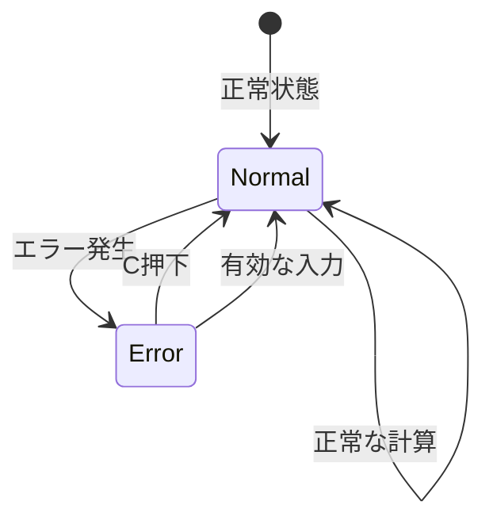

# エラーハンドリング仕様書

## 1. 概要
電卓アプリケーションのエラーハンドリング機能の詳細仕様を定義する。

## 2. エラー種別

### 2.1 ゼロ除算エラー
#### 2.1.1 発生条件
- **演算**: 除算（÷）
- **条件**: 除数が0の場合
- **例**: 5 ÷ 0

#### 2.1.2 検出方法
```javascript
if (secondOperand === 0 && operator === '÷') {
    return null; // エラーを示すnullを返す
}
```

#### 2.1.3 処理フロー
1. 除算実行前に除数をチェック
2. 0の場合はnullを返す
3. 呼び出し元でnullを検出
4. エラー表示処理を実行

### 2.2 オーバーフローエラー
#### 2.2.1 発生条件
- **結果**: ±Infinity
- **原因**: 計算結果がJavaScript Number型の範囲を超過
- **例**: 1.7976931348623157e+308 × 2

#### 2.2.2 検出方法
```javascript
const result = firstOperand + secondOperand;
if (!isFinite(result)) {
    return null; // エラーを示すnullを返す
}
```

#### 2.2.3 処理フロー
1. 計算結果をチェック
2. Infinityまたは-Infinityの場合はnullを返す
3. エラー表示処理を実行

### 2.3 NaN（Not a Number）エラー
#### 2.3.1 発生条件
- **結果**: NaN
- **原因**: 不正な数値演算
- **例**: 0 ÷ 0

#### 2.3.2 検出方法
```javascript
const result = firstOperand / secondOperand;
if (isNaN(result)) {
    return null; // エラーを示すnullを返す
}
```

## 3. エラー処理メカニズム

### 3.1 エラー検出
#### 3.1.1 計算レベル
```javascript
performCalculation(firstOperand, secondOperand, operator) {
    let result;
    switch (operator) {
        case '+':
            result = firstOperand + secondOperand;
            break;
        case '-':
            result = firstOperand - secondOperand;
            break;
        case '×':
            result = firstOperand * secondOperand;
            break;
        case '÷':
            if (secondOperand === 0) {
                return null; // ゼロ除算エラー
            }
            result = firstOperand / secondOperand;
            break;
        default:
            return secondOperand;
    }
    
    // 結果の有効性をチェック
    if (!isFinite(result) || isNaN(result)) {
        return null; // エラー
    }
    
    return result;
}
```

### 3.2 エラー表示
#### 3.2.1 エラー表示メソッド
```javascript
showError() {
    this.currentInput = 'ERROR';
    this.previousInput = '';
    this.operator = '';
    this.waitingForOperand = true;
    this.updateDisplay();
}
```

#### 3.2.2 表示仕様
- **表示文字**: "ERROR"
- **文字色**: #ff0000（赤）
- **継続時間**: 次の有効な入力まで

### 3.3 エラー復帰
#### 3.3.1 自動復帰
- **トリガー**: 次の有効な入力
- **動作**: 状態をリセットし、新しい計算を開始

#### 3.3.2 手動復帰
- **トリガー**: Cボタン（クリア）
- **動作**: 全状態をリセット

## 4. エラー状態管理

### 4.1 エラー状態
```javascript
const ErrorState = {
    NONE: 'none',
    ZERO_DIVISION: 'zero_division',
    OVERFLOW: 'overflow',
    UNDERFLOW: 'underflow',
    INVALID_OPERATION: 'invalid_operation'
};
```

### 4.2 状態遷移


## 5. 具体的エラーシナリオ

### 5.1 ゼロ除算のケース
#### 5.1.1 シナリオ1: 直接ゼロ除算
```
操作: 5 ÷ 0 =
結果: "ERROR"
状態: エラー状態
復帰: 任意の数値入力またはC押下
```

#### 5.1.2 シナリオ2: 連続計算でのゼロ除算
```
操作: 10 ÷ 5 ÷ 0 =
結果: 2まで正常計算、その後"ERROR"
状態: エラー状態
復帰: 任意の数値入力またはC押下
```

### 5.2 オーバーフローのケース
#### 5.2.1 シナリオ1: 大きな数値の乗算
```
操作: 1e+308 × 2 =
結果: "ERROR"
状態: エラー状態
復帰: 任意の数値入力またはC押下
```

#### 5.2.2 シナリオ2: 連続乗算
```
操作: 999999999999999 × 999999999999999 =
結果: "ERROR"（オーバーフロー）
状態: エラー状態
復帰: 任意の数値入力またはC押下
```

## 6. エラー処理の統合

### 6.1 計算処理での統合
```javascript
calculate() {
    const inputValue = parseFloat(this.currentInput);

    if (this.previousInput !== '' && this.operator) {
        const previousValue = parseFloat(this.previousInput);
        const result = this.performCalculation(previousValue, inputValue, this.operator);

        if (result === null) {
            this.showError();
            return;
        }

        this.currentInput = String(result);
        this.previousInput = '';
        this.operator = '';
        this.waitingForOperand = true;
        this.updateDisplay();
    }
}
```

### 6.2 演算子入力での統合
```javascript
inputOperator(nextOperator) {
    const inputValue = parseFloat(this.currentInput);

    if (this.previousInput === '') {
        this.previousInput = inputValue;
    } else if (this.operator) {
        const previousValue = parseFloat(this.previousInput);
        const currentValue = parseFloat(this.currentInput);
        const result = this.performCalculation(previousValue, currentValue, this.operator);

        if (result === null) {
            this.showError();
            return;
        }

        this.currentInput = String(result);
        this.previousInput = result;
        this.updateDisplay();
    }

    this.waitingForOperand = true;
    this.operator = nextOperator;
}
```

## 7. デバッグ支援

### 7.1 エラーログ
#### 7.1.1 ログ出力
```javascript
logError(errorType, operation, operands) {
    console.error(`Calculator Error: ${errorType}`, {
        operation: operation,
        operands: operands,
        timestamp: new Date().toISOString()
    });
}
```

#### 7.1.2 ログ項目
- エラー種別
- 実行された演算
- オペランド値
- 発生時刻

### 7.2 デバッグモード
#### 7.2.1 詳細エラー表示
```javascript
if (DEBUG_MODE) {
    this.currentInput = `Error: ${errorType}`;
} else {
    this.currentInput = 'Error';
}
```

## 8. テスト仕様

### 8.1 エラーテストケース
#### 8.1.1 ゼロ除算テスト
- 直接ゼロ除算: 5 ÷ 0
- 連続計算でのゼロ除算: 10 ÷ 5 ÷ 0
- 小数点でのゼロ除算: 3.14 ÷ 0

#### 8.1.2 オーバーフローテスト
- 大きな数値の乗算
- 連続乗算によるオーバーフロー
- 指数計算でのオーバーフロー

### 8.2 復帰テスト
#### 8.2.1 自動復帰テスト
- エラー後の数値入力
- エラー後の演算子入力
- エラー後の計算実行

#### 8.2.2 手動復帰テスト
- エラー後のC押下
- エラー後のクリア操作

## 9. ユーザビリティ

### 9.1 エラーメッセージの分かりやすさ
#### 9.1.1 現在の仕様
- **表示**: "ERROR"
- **利点**: シンプルで分かりやすい
- **欠点**: エラー種別が不明

#### 9.1.2 将来の改善案
- **詳細表示**: "Division by Zero"
- **多言語対応**: "ゼロ除算エラー"

### 9.2 エラー防止策
#### 9.2.1 入力制限
- 無効な文字の入力を防止
- 桁数制限の実装
- 演算子の重複入力制御

#### 9.2.2 警告表示
- 危険な操作の事前警告
- 計算結果の妥当性チェック

## 10. パフォーマンス考慮事項

### 10.1 エラー検出の効率性
- **事前チェック**: 計算前の条件確認
- **早期リターン**: エラー検出時の即座の処理終了

### 10.2 メモリ使用量
- **エラー状態**: 最小限のメモリ使用
- **ログ保存**: 必要に応じて制限