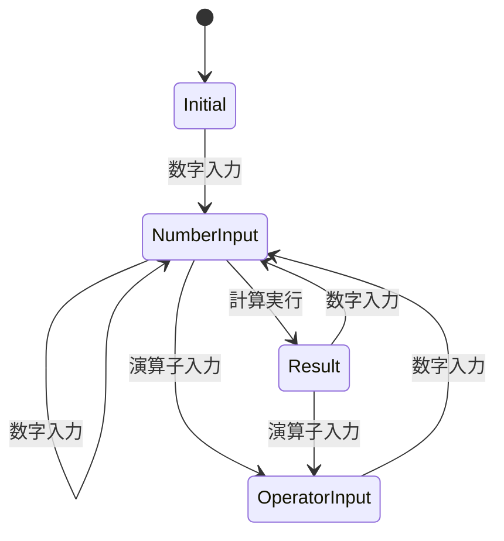

# 入力機能仕様書

## 1. 概要
電卓アプリケーションの数値・演算子入力機能の詳細仕様を定義する。

## 2. 数値入力機能

### 2.1 数字入力（0-9）
#### 2.1.1 基本動作
- **対象**: 数字キー 0-9
- **動作**: 押下された数字をディスプレーに表示
- **制限**: 最大15桁まで入力可能

#### 2.1.2 入力状態別動作
| 状態 | 動作 |
|------|------|
| 初期状態（0表示） | 入力数字で置き換え |
| 数値入力中 | 末尾に数字を追加 |
| 演算子入力後 | 新しい数値として開始 |
| 計算結果表示中 | 新しい数値として開始 |

#### 2.1.3 桁数制限
- **最大桁数**: 16桁
- **制限時動作**: 16桁を超える入力は無視
- **表示**: 桁数制限に達してもエラー表示なし

### 2.2 小数点入力
#### 2.2.1 基本動作
- **対象**: 小数点キー「.」
- **動作**: 現在の数値に小数点を追加
- **制限**: 1つの数値につき1つまで

#### 2.2.2 入力制御
```javascript
// 小数点重複チェック
if (currentInput.indexOf('.') === -1) {
    // 小数点追加
    currentInput += '.';
}
```

#### 2.2.3 エラーケース
- **重複入力**: 既に小数点が含まれている場合は無視
- **初期入力**: 「0.」として開始

## 3. 演算子入力機能

### 3.1 基本演算子
#### 3.1.1 対応演算子
- **加算**: + （Plus）
- **減算**: - （Minus）
- **乗算**: × （Multiply）
- **除算**: ÷ （Devide）

#### 3.1.2 入力動作
1. 現在の数値を第一オペランドとして保存
2. 演算子を保存
3. 次の数値入力を待機状態に設定
4. ディスプレイは現在の数値を継続表示

### 3.2 連続演算子入力
#### 3.2.1 動作仕様
- **同一演算子**: 最後の演算子を採用
- **異なる演算子**: 最後の演算子で上書き
- **中間計算**: 演算子変更時は中間計算を実行

#### 3.2.2 実装例
```javascript
// 連続演算子入力処理
if (this.operator && !this.waitingForOperand) {
    // 中間計算を実行
    const result = this.performCalculation();
    this.currentInput = String(result);
    this.previousInput = result;
}
this.operator = nextOperator;
this.waitingForOperand = true;
```

## 4. 特殊入力機能

### 4.1 全クリア機能（C）
#### 4.1.1 動作
- **対象**: Cボタン
- **動作**: 全ての状態をリセット

#### 4.1.2 リセット対象
- 現在の入力値 → "0"
- 前回の入力値 → ""
- 演算子 → ""
- 待機状態 → false

### 4.2 バックスペース機能（←）
#### 4.2.1 動作
- **1桁の場合**: "0" に設定
- **複数桁の場合**: 最後の1文字を削除

#### 4.2.2 実装
```javascript
deleteLast() {
    if (this.currentInput.length > 1) {
        this.currentInput = this.currentInput.slice(0, -1);
    } else {
        this.currentInput = '0';
    }
}
```

## 5. 入力検証

### 5.1 有効性チェック
- **数値範囲**: JavaScript Number型の範囲内
- **文字数制限**: 16文字以内
- **小数点**: 1つまで

### 5.2 不正入力処理
- **無効文字**: 無視
- **範囲外数値**: 科学記数法で表示
- **不正な演算子**: 無視

## 6. 状態管理

### 6.1 入力状態
```javascript
class InputState {
    currentInput: string;     // 現在の入力値
    previousInput: string;    // 前回の入力値
    operator: string;         // 演算子
    waitingForOperand: boolean; // オペランド待機状態
}
```

### 6.2 状態遷移


## 7. テスト仕様

### 7.1 単体テスト
- 数字入力の正常動作
- 小数点入力の制御
- 演算子入力の状態管理
- 桁数制限の動作

### 7.2 統合テスト
- 連続入力の動作
- 状態遷移の正確性
- エラーケースの処理

## 8. パフォーマンス要件

### 8.1 応答性能
- **入力応答時間**: 50ms以内
- **状態更新時間**: 10ms以内

### 8.2 メモリ使用量
- **状態オブジェクト**: 最小限のプロパティ
- **文字列処理**: 効率的な文字列操作