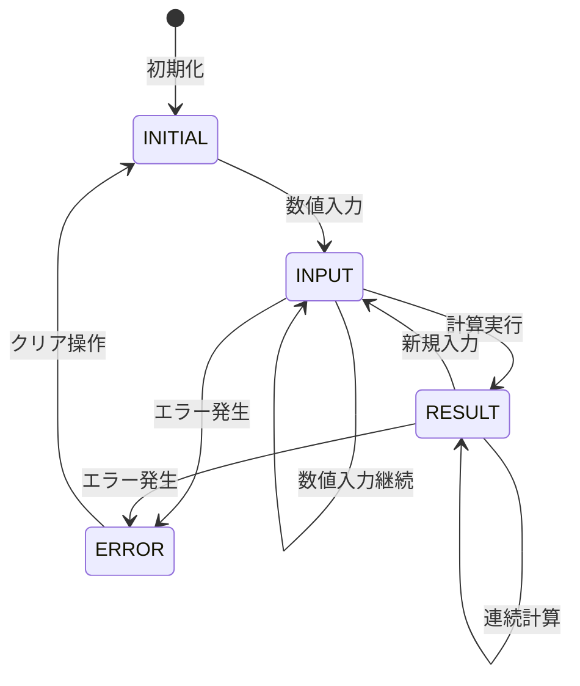

# 表示機能仕様書

## 1. 概要
電卓アプリケーションの表示機能の詳細仕様を定義する。

## 2. ディスプレイ仕様

### 2.1 基本構造
#### 2.1.1 HTML構造
```html
<div class="display">
    <div class="result" id="result">0</div>
</div>
```

#### 2.1.2 表示領域
- **要素**: div.result
- **初期値**: "0"
- **更新方法**: textContent プロパティ

### 2.2 表示内容
#### 2.2.1 表示状態
| 状態 | 表示内容 | 例 |
|------|----------|-----|
| 初期状態 | 0 | "0" |
| 数値入力中 | 入力中の数値 | "123" |
| 演算子入力後 | 前回の数値 | "123" |
| 計算結果 | 計算結果 | "246" |
| エラー状態 | Error | "Error" |

#### 2.2.2 数値表示ルール
- **整数**: そのまま表示
- **小数**: 小数点以下を含めて表示
- **負数**: マイナス符号付きで表示

## 3. 文字仕様

### 3.1 フォント設定
#### 3.1.1 基本設定
- **フォントファミリー**: Arial, sans-serif
- **フォントサイズ**: 22px
- **フォントウェイト**: normal
- **文字色**: #00ff00（グリーン）

#### 3.1.2 CSS設定
```css
.result {
    font-family: Arial, sans-serif;
    font-size: 22px;
    color: #00ff00;
    text-align: right;
    padding: 10px;
}
```

### 3.2 文字配置
#### 3.2.1 水平配置
- **配置**: 右寄せ（text-align: right）
- **理由**: 数値の桁揃えのため

#### 3.2.2 垂直配置
- **配置**: 中央揃え
- **パディング**: 10px

## 4. 表示制御

### 4.1 表示更新メソッド
#### 4.1.1 基本更新
```javascript
updateDisplay() {
    this.display.textContent = this.currentInput;
}
```

#### 4.1.2 呼び出しタイミング
- 数値入力時
- 演算子入力時
- 計算実行時
- クリア操作時
- エラー発生時

### 4.2 表示文字列の処理
#### 4.2.1 数値フォーマット
- **整数**: 区切り文字なし
- **小数**: 小数点表示
- **科学記数法**: 自動変換（1e+15以上）

#### 4.2.2 文字列長制限
- **最大長**: 20文字
- **超過時**: 科学記数法に変換

## 5. 特殊表示

### 5.1 エラー表示
#### 5.1.1 エラー文字列
- **表示**: "ERROR"
- **色**: #ff0000（赤）
- **継続時間**: 次の有効な入力まで

#### 5.1.2 エラー発生時の処理
```javascript
showError() {
    this.currentInput = 'ERROR';
    this.display.textContent = 'ERROR';
    this.display.style.color = '#ff0000';
}
```

### 5.2 科学記数法表示
#### 5.2.1 変換条件
- **大きな数**: 1e+15以上
- **小さな数**: 1e-15以下

#### 5.2.2 表示形式
- **例**: 1.234567890123456e+15
- **小数点以下**: 最大15桁

## 6. レスポンシブ対応

### 6.1 画面サイズ別対応
#### 6.1.1 デスクトップ
- **幅**: 320px
- **フォントサイズ**: 24px

#### 6.1.2 タブレット
- **幅**: 画面幅の80%
- **フォントサイズ**: 22px

#### 6.1.3 スマートフォン
- **幅**: 画面幅の90%
- **フォントサイズ**: 20px

### 6.2 CSS メディアクエリ
```css
@media (max-width: 768px) {
    .result {
        font-size: 22px;
    }
}

@media (max-width: 480px) {
    .result {
        font-size: 20px;
    }
}
```

## 7. アクセシビリティ

### 7.1 視認性
#### 7.1.1 コントラスト
- **背景色**: #000000（黒）
- **文字色**: #00ff00（グリーン）
- **コントラスト比**: 4.5:1以上

#### 7.1.2 フォントサイズ
- **最小サイズ**: 16px
- **推奨サイズ**: 24px

### 7.2 スクリーンリーダー対応
#### 7.2.1 ARIA属性
```html
<div class="result" 
     id="result" 
     role="textbox" 
     aria-live="polite" 
     aria-label="計算結果">0</div>
```

#### 7.2.2 更新通知
- **aria-live**: "polite"
- **更新時**: スクリーンリーダーが変更を読み上げ

## 8. 表示状態管理

### 8.1 状態定義
```javascript
const DisplayState = {
    INITIAL: 'initial',      // 初期状態
    INPUT: 'input',          // 入力中
    RESULT: 'result',        // 結果表示
    ERROR: 'error'           // エラー状態
};
```

### 8.2 状態遷移


## 9. パフォーマンス仕様

### 9.1 表示更新性能
- **目標**: 17ms以内（60fps）
- **測定**: DOM更新から画面反映まで

### 9.2 メモリ使用量
- **表示文字列**: 最小限のメモリ使用
- **DOM要素**: 単一要素でのシンプルな構造

## 10. 国際化対応

### 10.1 数値表示
#### 10.1.1 小数点記号
- **日本**: "." (ピリオド)
- **将来拡張**: ","（カンマ）にも対応可能

#### 10.1.2 桁区切り
- **現在**: 区切りなし
- **将来拡張**: 3桁区切りカンマ対応

### 10.2 エラーメッセージ
- **現在**: "Error"（英語）
- **将来拡張**: "エラー"（日本語）対応

## 11. テスト仕様

### 11.1 表示テスト項目
- 各状態での正確な表示
- 数値フォーマットの正確性
- エラー表示の動作
- レスポンシブ対応

### 11.2 パフォーマンステスト
- 表示更新速度
- メモリ使用量
- 描画パフォーマンス

### 11.3 アクセシビリティテスト
- コントラスト比の確認
- スクリーンリーダー対応
- キーボードナビゲーション